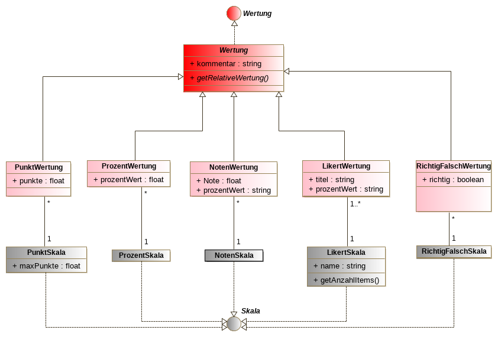

# Grobe Planung Datenstruktur

Anforderungen:

* Möglichst dynamische Abbildung von Prüfungsergebnissen verschiedener Art
* Clusterung der Ergebnisse nach nicht vorhersehbaren Kriterien
* Performante Abfrage

#### UML-Diagramm 1: Prüfungen und Clusterung

#### UML-Diagramm 2: Wertungen

#### 