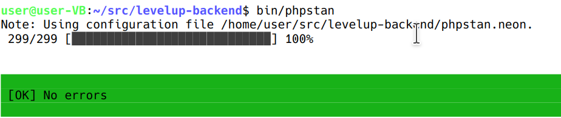

# Statische Codeanalyse mit phpStan

PHPStan ist ein Tool, was den Code analysiert und typische Fehler findet. Außerdem wird in der geg. Konfiguration eine möglichst starke Typisierung erzwungen, was Fehler vermindert aber - wo nötig - die dynamische Typisierung von PHP erhält.

##### Ausführung:

 [bin/phpstan](../../bin/phpstan) 

##### Ergebnis:

##### Konfiguration
Es werden einige Einstellungen gemacht, so dass nicht behebbare Fehler nicht auftauchen.
Siehe [phpstan.neon](../../phpstan.neon) 